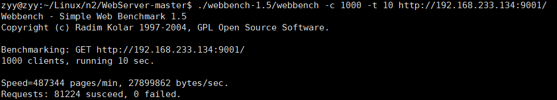

# WebServer
基于C++和Linux实现的Web服务器，经过webbenchh压力测试可以实现上万的QPS

## 功能详情
* 利用IO复用技术Epoll与线程池实现事件处理(Reactor和模拟Proactor均实现)的高并发模型
* 利用状态机解析HTTP请求报文，实现处理静态资源的请求，支持GET和POST请求；
* 基于小根堆实现的定时器，关闭超时的非活动连接；
* 利用单例模式与阻塞队列实现异步的日志系统，记录服务器运行状态；
* 利用单例模式实现了简单的线程池和，减少了线程创建与销毁的开销；
* 利用单例模式实现了MySQL数据库连接池，能够通过访问数据库实现了用户注册登录功能；
* 实现了文件上传功能，能够处理前端发送的multi/form-data类型的POST请求；
* 将上传的文件目录通过jsoncpp生成json文件，实现了文件列表的展示以及下载功能。

## 环境要求
* Linux
* C++14
* MySql
* jsoncpp


## 项目启动
需要先配置好对应的数据库
```bash
// 建立yourdb库
create database yourdb;

// 创建user表
USE yourdb;
CREATE TABLE user(
    username char(50) NULL,
    password char(50) NULL
)ENGINE=InnoDB;

// 添加数据
INSERT INTO user(username, password) VALUES('name', 'password');
```

```bash
make
./bin/server
```

## 压力测试
```bash
./webbench-1.5/webbench -c 100 -t 10 http://ip:port/
./webbench-1.5/webbench -c 1000 -t 10 http://ip:port/
./webbench-1.5/webbench -c 5000 -t 10 http://ip:port/
./webbench-1.5/webbench -c 10000 -t 10 http://ip:port/
```
* 测试环境: Ubuntu:18.04 内存:4G （虚拟机）
* QPS 10000+
* 实验结果



* 实验效果

## **致谢**
* Linux高性能服务器编程，游双著
* [markparticle/WebServer](https://github.com/markparticle/WebServer)
* [qinguoyi/TinyWebServer](https://github.com/qinguoyi/TinyWebServer)
* [Sakura1221/SimpleWebServer](https://github.com/Sakura1221/SimpleWebServer)

